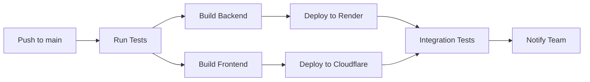

# 🔄 Development Workflow Guide

This guide outlines the recommended development workflows for contributing to and maintaining this full-stack application.

## 🎯 Overview

Our workflow is designed to:
- **Maintain code quality** through automated checks
- **Ensure reliable deployments** with CI/CD
- **Support collaboration** with clear branching strategies
- **Minimize conflicts** with structured development practices

## 🌳 Branching Strategy

### Branch Types

| Branch Type | Purpose | Example | Lifetime |
|-------------|---------|---------|----------|
| `main` | Production-ready code | `main` | Permanent |
| `feature/*` | New features | `feature/user-auth` | Temporary |
| `fix/*` | Bug fixes | `fix/login-validation` | Temporary |
| `hotfix/*` | Critical production fixes | `hotfix/security-patch` | Temporary |
| `release/*` | Release preparation | `release/v1.2.0` | Temporary |

### Naming Conventions

```bash
# Features
git checkout -b feature/user-authentication
git checkout -b feature/payment-integration
git checkout -b feature/admin-dashboard

# Bug fixes
git checkout -b fix/cors-headers
git checkout -b fix/database-connection
git checkout -b fix/responsive-layout

# Hotfixes
git checkout -b hotfix/security-vulnerability
git checkout -b hotfix/critical-bug

# Releases
git checkout -b release/v1.2.0
git checkout -b release/v2.0.0-beta
```

## 🚀 Feature Development Workflow

### 1. Planning Phase
```bash
# Start from main branch
git checkout main
git pull origin main

# Create feature branch
git checkout -b feature/your-feature-name
```

### 2. Development Phase
```bash
# Set up development environment
cd backend && python dev.py setup
cd frontend && node dev.js setup

# Start development servers
cd backend && python dev.py server    # Terminal 1
cd frontend && node dev.js server     # Terminal 2
```

### 3. Coding Standards
- **Backend**: Follow PEP 8, use type hints, write docstrings
- **Frontend**: Use ESLint/Prettier, follow React best practices
- **Commits**: Use conventional commit messages
- **Testing**: Write tests for new features

### 4. Quality Checks
```bash
# Backend quality checks
cd backend
python dev.py lint          # Check code style
python dev.py format        # Auto-format code
python dev.py test          # Run tests

# Frontend quality checks  
cd frontend
node dev.js lint            # Check code style
node dev.js fix             # Auto-fix issues
node dev.js test            # Run tests
```

### 5. Database Changes
```bash
# If you modified database models
cd backend
python dev.py db-migrate "descriptive message"
python dev.py db-upgrade

# Test with fresh database
python dev.py db-reset      # ⚠️ Deletes all data
python dev.py db-upgrade
```

### 6. Commit and Push
```bash
# Stage changes
git add .

# Commit with conventional message
git commit -m "feat: add user authentication system

- Add JWT token generation and validation
- Create login/register endpoints
- Add password hashing with bcrypt
- Include user session management"

# Push to remote
git push origin feature/your-feature-name
```

## 📝 Commit Message Convention

We follow [Conventional Commits](https://www.conventionalcommits.org/):

### Format
```
<type>[optional scope]: <description>

[optional body]

[optional footer(s)]
```

### Types
- **feat**: New feature
- **fix**: Bug fix
- **docs**: Documentation changes
- **style**: Code style changes (formatting, etc.)
- **refactor**: Code refactoring
- **test**: Adding or updating tests
- **chore**: Maintenance tasks

### Examples
```bash
# Feature
git commit -m "feat(auth): add JWT authentication system"

# Bug fix
git commit -m "fix(api): resolve CORS headers issue"

# Documentation
git commit -m "docs: update deployment guide with new steps"

# Refactoring
git commit -m "refactor(db): optimize user query performance"

# Multiple changes
git commit -m "feat: implement user dashboard

- Add user profile management
- Create settings page
- Add data export functionality
- Update navigation menu"
```

## 🔍 Code Review Process

### 1. Pull Request Creation
```bash
# Create PR from your feature branch to main
# Use GitHub CLI (optional)
gh pr create --title "feat: add user authentication" --body "Implements JWT-based authentication system with login/register endpoints"
```

### 2. PR Template
Include in your PR description:
- **What**: Brief description of changes
- **Why**: Problem being solved
- **How**: Implementation approach
- **Testing**: How you tested the changes
- **Screenshots**: For UI changes

### 3. Review Checklist
**For Reviewers:**
- [ ] Code follows style guidelines
- [ ] Tests pass and coverage is adequate
- [ ] No security vulnerabilities introduced
- [ ] Documentation is updated
- [ ] Breaking changes are documented
- [ ] Performance impact is acceptable

**For Authors:**
- [ ] Self-review completed
- [ ] All quality checks pass
- [ ] Tests added for new functionality
- [ ] Documentation updated
- [ ] Ready for production

### 4. Merge Strategy
- **Squash and merge** for feature branches
- **Merge commit** for important milestones
- **Rebase and merge** for clean history (optional)

## 🔄 CI/CD Pipeline

### Automated Checks
On every push and PR:
- **Linting**: Code style checks
- **Testing**: Unit and integration tests
- **Build**: Verify build succeeds
- **Security**: Dependency vulnerability scans

### Deployment Pipeline


## 🐛 Bug Fix Workflow

### 1. Hotfix Process
```bash
# For critical production issues
git checkout main
git pull origin main
git checkout -b hotfix/critical-issue-name

# Make minimal fix
# Test thoroughly
# Deploy immediately

git commit -m "hotfix: resolve critical security vulnerability"
git push origin hotfix/critical-issue-name

# Create PR for immediate review and merge
```

### 2. Regular Bug Fixes
```bash
# For non-critical issues
git checkout main
git pull origin main
git checkout -b fix/issue-name

# Follow normal development workflow
# Include regression tests
```

## 🔄 Release Workflow

### 1. Prepare Release
```bash
git checkout main
git pull origin main
git checkout -b release/v1.2.0

# Update version numbers
# Update CHANGELOG.md
# Final testing
```

### 2. Version Numbering
Follow [Semantic Versioning](https://semver.org/):
- **MAJOR**: Breaking changes
- **MINOR**: New features (backward compatible)
- **PATCH**: Bug fixes (backward compatible)

Examples:
- `1.0.0` → `1.1.0` (new features)
- `1.1.0` → `1.1.1` (bug fixes)
- `1.1.1` → `2.0.0` (breaking changes)

### 3. Release Checklist
- [ ] All features tested
- [ ] Documentation updated
- [ ] Version numbers bumped
- [ ] CHANGELOG.md updated
- [ ] Release notes prepared
- [ ] Deployment tested in staging
- [ ] Team notified of release

## 🧪 Testing Strategy

### Development Testing
```bash
# Run tests during development
cd backend && python dev.py test
cd frontend && node dev.js test

# Run specific tests
cd backend && pytest tests/test_auth.py
cd frontend && npm test -- --testNamePattern="Auth"
```

### Pre-commit Testing
```bash
# Full test suite before committing
make test-all  # If Makefile available
# OR
cd backend && python dev.py test && python dev.py lint
cd frontend && node dev.js test && node dev.js lint
```

### Integration Testing
```bash
# Test full stack locally
# 1. Start both servers
# 2. Run end-to-end tests
# 3. Check all API endpoints
# 4. Verify database operations
```

## 🔧 Environment Management

### Development Environments
- **Local**: Your development machine
- **Feature**: Feature branch deployments (optional)
- **Staging**: Pre-production testing
- **Production**: Live application

### Environment Variables
```bash
# Development
cp backend/.env.example backend/.env
cp frontend/.env.example frontend/.env

# Production
# Set in deployment platform (Render/Cloudflare)
```

## 📚 Knowledge Sharing

### Documentation
- Update docs with new features
- Create runbooks for complex procedures
- Document troubleshooting steps
- Maintain API documentation

### Team Communication
- **Daily standups**: Progress updates
- **Code reviews**: Knowledge sharing
- **Architecture decisions**: Document reasoning
- **Post-mortems**: Learn from incidents

## 🆘 Troubleshooting Workflow Issues

### Common Issues
1. **Merge conflicts**: Use `git rebase` or merge tools
2. **Failed tests**: Check logs and fix issues
3. **Build failures**: Verify dependencies and environment
4. **Deployment issues**: Check configuration and logs

### Getting Help
1. **Check documentation** (this guide, README, etc.)
2. **Review recent changes** that might have caused issues
3. **Check CI/CD logs** for specific error messages
4. **Ask team members** for assistance
5. **Create GitHub issues** for persistent problems

---

## 📋 Quick Reference

### Daily Commands
```bash
# Start development
git checkout main && git pull
cd backend && python dev.py server
cd frontend && node dev.js server

# Quality checks
python dev.py lint && node dev.js lint
python dev.py test && node dev.js test

# Commit work
git add . && git commit -m "feat: description"
git push origin branch-name
```

### Emergency Commands
```bash
# Reset development environment
python dev.py clean && python dev.py setup
node dev.js clean && node dev.js setup

# Reset database (⚠️ deletes data)
python dev.py db-reset

# Force fresh install
rm -rf node_modules venv
npm install && python -m venv venv && pip install -r requirements.txt
```

---

**Happy coding!** 🚀 Remember: when in doubt, ask for help and document what you learn!